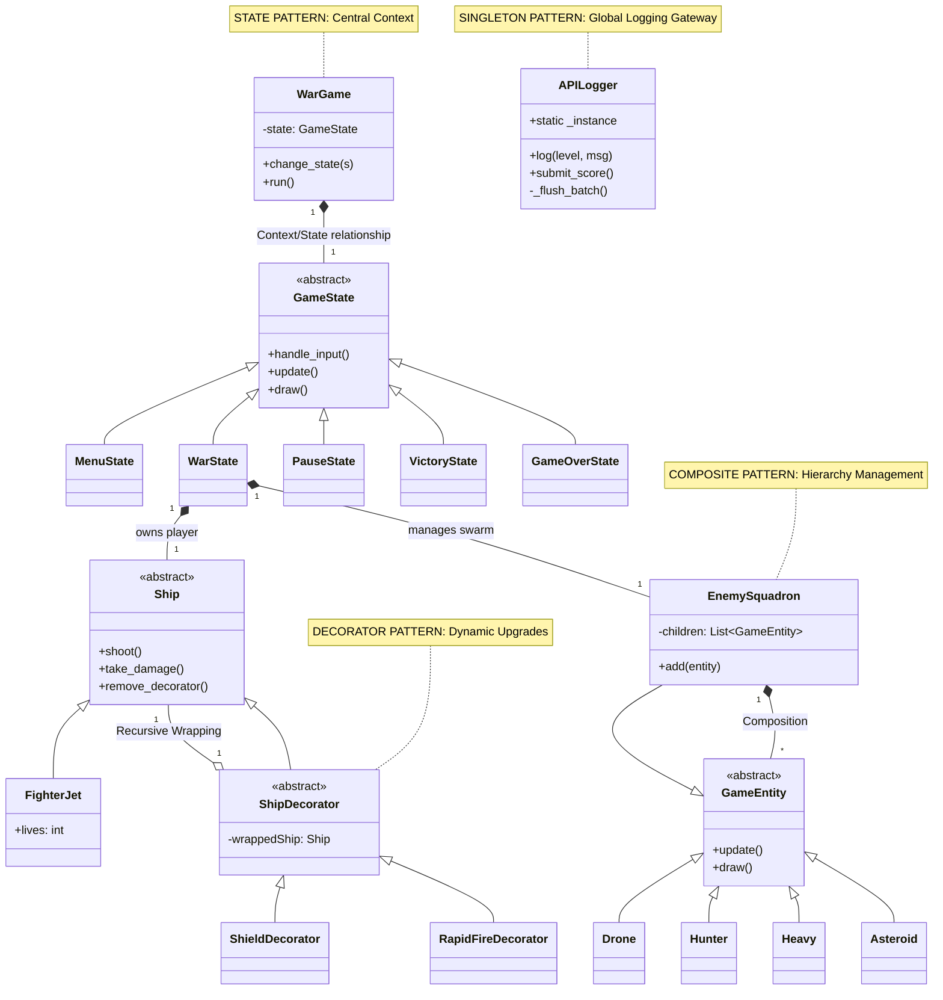

# API Defender - Final Technical Report

## 1. Executive Summary
**API Defender** is a secure, cloud-integrated arcade shooter developed as a pedagogical showcase for Advanced Design Patterns. The project bridges the gap between classic game development and modern enterprise architecture by integrating real-time cloud logging, procedural content generation, and strict object-oriented design principles.

## 2. Use Case Diagram
The following diagram illustrates the primary interactions between the Pilot (User) and the System.

```mermaid
useCaseDiagram
    actor Pilot
    actor "Cloud API Server" as API

    rectangle "API Defender System" {
        useCase (Select Mission) as UC1
        useCase (Engage Combat) as UC2
        useCase (Collect Power-ups) as UC3
        useCase (Pause Game) as UC4
        useCase (Configure Settings) as UC5
        useCase (View Global Leaderboard) as UC6
        useCase (Batch Log Events) as UC7
        useCase (Submit High Score) as UC8
    }

    Pilot --> UC1
    Pilot --> UC2
    Pilot --> UC3
    Pilot --> UC4
    Pilot --> UC5
    
    UC1 ..> UC6 : <<includes>>
    UC2 ..> UC7 : <<triggers>>
    UC3 ..> UC7 : <<triggers>>
    UC2 ..> UC8 : <<triggers on death>>
    
    UC7 --> API : Batch POST
    UC8 --> API : Single POST
```

## 3. Class Diagram
This diagram highlights the implementation of the **State**, **Decorator**, and **Composite** patterns.



## 4. Design Pattern Analysis

### 4.1 State Pattern (Behavioral)
**Implementation**: The `WarGame` class acts as the **Context**, maintaining a reference to a `GameState` subclass. 
**Logic**: Transitions between `MenuState`, `WarState`, `PauseState`, `VictoryState`, and `GameOverState` are handled via `change_state()`. This eliminates conditional branching (if/else) in the main game loop, providing a clean separation between different game phases and UI screens.

### 4.2 Decorator Pattern (Structural)
**Implementation**: The `Ship` interface is implemented by `FighterJet` (Concrete Component) and `ShipDecorator` (Base Decorator).
**Logic**: Upgrades like `ShieldDecorator` and `RapidFireDecorator` wrap the ship at runtime to extend functionality without inheritance. Our implementation includes a **Recursive Unwrap** mechanism (`remove_decorator`), allowing for the robust removal of specific layers (like a broken shield) while preserving others.

### 4.3 Composite Pattern (Structural)
**Implementation**: `GameEntity` is the common interface. `Drone` and `Asteroid` are the **Leaf** nodes, while `EnemySquadron` is the **Composite**.
**Logic**: The `EnemySquadron` manages a collection of entities. The client (WarState) treats a single Drone and a whole Squadron uniformly by calling `update()` or `draw()`, which the Composite then propagates to all its children.

### 4.4 Singleton Pattern (Creational)
**Implementation**: The `APILogger` class restricts instantiation to a single static `_instance`.
**Logic**: This pattern provides a global point of access for all logging and high-score operations. By centralizing all network calls through one instance, we achieved complex **Asynchronous Batching** without creating multiple competing network threads, ensuring optimized resource usage.

## 5. Technical Merits & Improvements (V2.6)
- **Advanced Composite Leaf Diversification**: Expanded the `EnemySquadron` hierarchy with `Hunter` and `Heavy` classes. This demonstrates specialized leaf behaviors such as targeting markers and multi-hit HP management while maintaining uniform treatment by the Composite.
- **Time-Aware Decorator Logic**: Refactored the Decorator pattern to handle temporal state. Decorators now maintain internal timers and autonomously unwrap from the `Ship` component upon duration expiry, returning a signal to the `WarState` controller.
- **Progression-Linked Gameplay Balance**: Integrated wave-locking mechanisms into spawning and power-up controllers. Specifically, the Triple Shot (Rapid Fire) upgrade is locked until Wave 3, ensuring a progressive difficulty curve.
- **Defensive Asset Loading**: Implemented a `load_image_fallback` utility that uses absolute path resolution (`os.path.abspath`) and `sys._MEIPASS` checks to guarantee game stability in all environments (IDE vs EXE). It includes cross-extension matching and falls back to procedural drawing only as a last resort.
- **Optimized Rendering Pipeline**: Utilized `pygame.SCALED` for hardware-agnostic fullscreen support. Implemented aggressive surface caching with `.convert_alpha()` to pre-compile complex assets (StarField, HUD) into GPU-friendly formats, maintaining 60FPS at high resolutions.
- **Health Cap Implementation**: Enforced a strict 10-heart limit on player health to prevent infinite scaling and maintain game tension in later waves.
