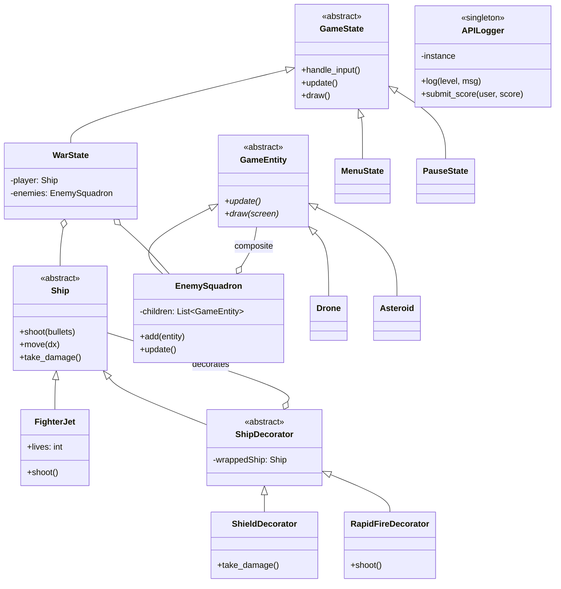

# API Defender - Final Technical Report

## 1. Executive Summary
**API Defender** is a secure, cloud-integrated arcade shooter developed as a pedagogical showcase for Advanced Design Patterns. The project bridges the gap between classic game development and modern enterprise architecture by integrating real-time cloud logging, procedural content generation, and strict object-oriented design principles.

## 2. Use Case Diagram
The following diagram illustrates the primary interactions between the Pilot (User) and the System.

```mermaid
useCaseDiagram
    actor Pilot
    actor "Cloud API Server" as API

    rectangle "API Defender System" {
        useCase (Select Mission) as UC1
        useCase (Engage Combat) as UC2
        useCase (Collect Power-ups) as UC3
        useCase (Pause Game) as UC4
        useCase (View Global Leaderboard) as UC5
        useCase (Log Operational Data) as UC6
    }

    Pilot --> UC1
    Pilot --> UC2
    Pilot --> UC3
    Pilot --> UC4
    UC1 ..> UC5 : <<includes>>
    UC2 ..> UC6 : <<triggers>>
    UC3 ..> UC6 : <<triggers>>
    UC6 --> API
```

## 3. Class Diagram
This diagram highlights the implementation of the **State**, **Decorator**, and **Composite** patterns.



## 4. Design Pattern Analysis

### 4.1 State Pattern
Used to manage scenes. By encapsulating game logic into `MenuState`, `WarState`, and `PauseState`, we avoid complex "if-else" or "switch" structures in the main loop. This makes the game highly extensible for adding new modes (e.g., Level Selection).

### 4.2 Decorator Pattern
Applied to the player's ship. Instead of creating subclasses like `ShieldedFighter` or `RapidFireFighter`, we wrap the base `FighterJet` at runtime. This allows for stacking effects (e.g., a shielded ship that also has rapid fire).

### 4.3 Composite Pattern
Manages the swarm of enemies. The `EnemySquadron` acts as a composite that can hold both individual `Drones` and `Asteroids`. Calling `update()` on the squadron automatically propagates the call to all children.

### 4.4 Singleton Pattern
The `APILogger` ensures that regardless of where an event happens (UI, Physics, or Logic), all logs are sent through a single thread-safe gateway to the cloud server.

## 5. Technical Merits
- **Asynchronous Cloud Sync**: Uses Python `threading` to prevent network latency from affecting the 60FPS gameplay.
- **RESTful Integration**: Communications are secured with an API Key and structured via JSON.
- **Procedural Rendering**: No external sprite dependencies; all visuals are drawn using vector mathematics.
